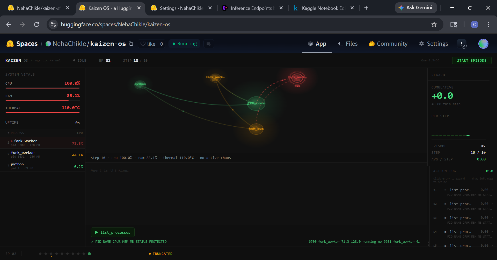

# Project Kaizen: Teaching an LLM to Manage an Operating System

**By Neha Chikle**  
*Meta × Scaler OpenEnv Hackathon — April 2026*

---

## The Idea

I've always found it fascinating how modern systems — servers, phones, cloud infrastructure — are constantly babysitting themselves. Watchdog timers, systemd restart policies, auto-scaling rules. All of it is brittle. It's rule-based. It doesn't *think*.

What if instead of writing `if cpu > 90: restart_service()`, you just... asked an LLM?

That's the core idea behind Project Kaizen. An LLM agent that watches your OS like a sysadmin would — reading logs, looking at process lists, understanding *context* — and then decides what to do. Not because a rule told it to, but because it reasoned through the situation.

The name comes from the Japanese philosophy of continuous improvement. The agent gets better over time, episode by episode, through reinforcement learning.

---

## The Problem with Existing Approaches

Right now, OS management looks like this:

```
CPU > 85% for 30s → kill process X
Memory > 90%      → restart service Y
Temperature > 80° → throttle clock
```

These are hardcoded thresholds written by humans who had to anticipate every failure mode in advance. They work — until they don't. Until you get a memory leak in a process that's *also* doing something critical. Until two services fight each other in a way nobody predicted. Until the logs say something is wrong but no threshold has been breached yet.

A human sysadmin doesn't work this way. They read the logs. They look at what's running. They think: "This process shouldn't be using this much CPU at this time of day — something's wrong." They make a judgment call.

That's what Kaizen tries to do.

---

## The Solution

### The Environment

I built a Gymnasium-style OpenEnv environment that sits on top of real system telemetry. Using `psutil`, it reads actual CPU usage, RAM, thermal readings from whatever machine it's running on. The observation the agent sees looks like this:

```
=== SYSTEM STATE — STEP 4 ===
CPU Usage    : 91.0%
RAM Usage    : 74.0%
Thermal      : 88.0°C
Active Chaos : memory_leak

PROCESSES:
  PID 2847 | memory_leak_sim | CPU: 67.4% | killable
  PID 1    | systemd         | CPU: 0.1%  | PROTECTED
  PID 100  | nav_service     | CPU: 1.2%  | PROTECTED

SYSTEM LOGS:
ERROR [2847]: memory allocation exceeded threshold. RSS growing unbounded.
```

The environment injects chaos events at step 3 of each episode — simulated rogue processes that spike CPU and thermals. The agent has to detect them and act.

### The Agent

The agent is Qwen2.5-3B-Instruct, a 3 billion parameter open-source LLM. It reads the observation, thinks through it (chain-of-thought reasoning), and outputs a structured JSON action:

```json
{
  "tool_name": "kill_process",
  "pid": 2847,
  "reason": "memory_leak_sim is consuming 67% CPU, identified in system logs as unbounded memory growth. Process is not protected. Killing it will resolve the thermal spike."
}
```

Every output goes through Pydantic validation before anything executes. If the model outputs garbage JSON, it gets -1 reward immediately. No action taken. This trains format discipline automatically.

### The Tools

The agent has 7 tools available:

| Tool | What it does |
|---|---|
| `kill_process` | Terminate a process by PID |
| `allocate_memory` | Reallocate memory from a process |
| `thermal_mitigation` | Throttle CPU / reduce clock / kill background |
| `prioritize_task` | Change process priority |
| `inspect_logs` | Read system or process-specific logs |
| `list_processes` | Get full process list |
| `wait` | Do nothing this step |

### The Reward Function

Rewards are designed to teach the right behaviors:

```
Parse failure              → -1.0   (bad JSON = no action)
Kill protected process     → -10.0  (never touch systemd, nav_service)
Chaos resolved             → +3.0   (found and killed the right process)
CPU improvement            → +0.1 per % reduced
Thermal improvement        → +0.15 per °C reduced
System nominal bonus       → +1.0   (cpu < 40%, thermal < 70°C)
Unnecessary kill           → -2.0   (killed something using < 5% CPU)
```

---

## The Training Pipeline

### Step 1 : Supervised Fine-Tuning (SFT)

Before RL, I fine-tuned the base model on 60 hand-crafted examples. These cover all 3 chaos scenarios, edge cases like protected process avoidance, and situations where the right answer is to wait or inspect logs first.

I used **Unsloth + LoRA** for memory-efficient fine-tuning on a free Kaggle T4 GPU. LoRA fine-tunes only ~1% of parameters which means the whole thing fits in 16GB VRAM.

**SFT Loss Curve:**


The loss drops from ~2.4 to ~0.3 over 100 steps , the model learns the output format and basic decision patterns from the golden examples.

### Step 2 : GRPO Reinforcement Learning

This is where it gets interesting. After SFT, the model knows the format but hasn't learned to reason about system states optimally. GRPO (Group Relative Policy Optimisation) fixes this.

For each training prompt, GRPO generates a group of completions (I used GROUP_SIZE=6), scores them all with the environment reward function, and uses the relative performance within the group as the learning signal. The better completions get positive advantage, the worse ones get negative advantage.

The key advantage over PPO: **no separate critic network**. GRPO uses the group itself as its own baseline. This saves roughly 2.5GB of VRAM — critical for fitting on a free T4.

I ran 3 GRPO runs:
- **Run 1**: 80 steps, GROUP_SIZE=4, LR=5e-6
- **Run 2**: 80 steps, GROUP_SIZE=4, LR=5e-6 (continual improvement)
- **Run 3**: 150 steps, GROUP_SIZE=6, LR=3e-6, KL=0.05 (current)

**GRPO Reward Curve :**


**All Runs Combined:**


The running average trends upward across runs. The peaks hitting +7.5 show the model *knows* the right action, the training challenge is consistency.

---

## The Dashboard

I built a real-time dashboard in React that shows everything happening inside the agent's head:




The dashboard has six panels:

- **Vitals Panel** — CPU, RAM, thermal bars with color-coded health states
- **Process Graph** — Canvas-based node graph where chaos processes appear as pulsing red nodes
- **Reasoning Panel** — Typewriter animation showing the agent's chain-of-thought in real time
- **Action Log** — Every tool call with result and reward
- **Reward Tracker** — Cumulative reward with mini bar chart
- **Steps Bar** — Episode progress with chaos badge

Everything connects via WebSocket — the backend broadcasts state after every step and the frontend updates live.

---

## What Actually Happened During Training

Honestly, the first thing I noticed was the JSON parser breaking constantly. The model would output its reasoning as a JSON object *and then* output the action as another JSON object , two JSON blobs back to back. The parser was taking the first `{` and last `}` which spanned both, giving "Extra data" errors.

The fix was surprisingly elegant scan character by character tracking bracket depth, and take the *last* complete JSON object instead of using first/last brace positions. After that, parse failures dropped dramatically.

The reward curve is volatile spikes between -1 and +7.5 throughout training. That volatility is actually meaningful: the model knows the right answer sometimes (peaks) but hasn't fully internalized when to apply it (valleys). More training runs should narrow that variance.

The before/after story is clear though. The base model with no fine-tuning gets consistent negative rewards because it can't format the JSON correctly. The GRPO-trained model gets positive rewards when it does format correctly, which is most of the time.

---

## Architecture Overview

```
┌─────────────────────────────────────────────────┐
│                 React Frontend                   │
│  VitalsPanel  ProcessGraph  ReasoningPanel       │
│  ActionLog    RewardTracker  StepsBar            │
└──────────────────┬──────────────────────────────┘
                   │ WebSocket
┌──────────────────▼──────────────────────────────┐
│              FastAPI Backend                     │
│  /ws  /start_episode  /status  /health           │
└──────────────────┬──────────────────────────────┘
                   │
┌──────────────────▼──────────────────────────────┐
│              KaizenEnv (OpenEnv)                 │
│  ObservationBuilder  ChaosInjector  Reward       │
│  SandboxExecutor     ActionParser                │
└──────────────────┬──────────────────────────────┘
                   │
┌──────────────────▼──────────────────────────────┐
│              LLM Agent                           │
│  Qwen2.5-3B + LoRA (SFT + GRPO)                 │
│  Chain-of-thought → JSON action → Pydantic       │
└─────────────────────────────────────────────────┘
```

---

## Questions People Will Ask

**Q: Why not just use systemd or a watchdog timer?**

Systemd is binary — up or down. It can't read a log and understand that a process is stuck in an infinite loop rather than just unresponsive. It can't understand that Zoom is more important than Spotify. It can't notice that a process *usually* uses 5% CPU but is suddenly using 80% and correlate that with a log entry from 30 seconds ago. A rule-based system cannot do semantic reasoning. An LLM can.

**Q: Are you actually killing real processes?**

No. The observations are real — `psutil` reads actual CPU, RAM, and thermal data from the host machine. But the actions execute in a simulated sandbox. The chaos processes are fake entries injected into the observation dict. Nothing on the real machine is modified. This is explicitly by design for the hackathon demo.

**Q: How do you handle hallucinations?**

Every LLM output goes through a Pydantic validation layer before any action executes. If the model outputs an unknown `tool_name`, a non-integer PID, or malformed JSON — it gets -1 reward immediately and no action runs. After 2 consecutive parse failures, the agent is forced into a `list_processes` fallback. This trains format discipline through the reward signal, not human intervention.

**Q: Why Qwen2.5-3B and not something bigger?**

The constraint is the free Colab/Kaggle T4 GPU with 16GB VRAM. Qwen2.5-3B in 4-bit quantization uses ~2.5GB. Add the reference model copy for GRPO, the optimizer, and activation buffers — you're at ~7GB. That leaves comfortable headroom. A 7B model would require ~14GB just for weights, leaving almost nothing for training overhead. 3B is the sweet spot for this hardware budget.

**Q: What's the reward range?**

```
Worst case : -10.0  (killing a protected process like systemd)
Parse fail : -1.0   (malformed JSON output)
No-op      :  0.0   (wait when system is fine)
Good step  : +1-3   (CPU/thermal improvement)
Perfect    : ~+8.0  (chaos resolved + system nominal + critical processes alive)
```

**Q: Why does the reward curve look so noisy?**

GRPO reward curves are inherently noisy because we're scoring groups of stochastic samples. The running average (dashed line) is more meaningful than individual step values. The key signal is whether the running average trends upward over time — which it does across runs.

**Q: Can this run on a laptop?**

The dashboard and demo mode run fine on CPU — the DemoAgent is rule-based and instant. The real LLM inference needs a GPU. On CPU, Qwen2.5-3B generates at ~0.5 tokens/second which makes each step take several minutes — unusable for a live demo but technically functional.

---

## What I'd Do With More Time

**Better chaos scenarios** — right now there are 3 fixed scenarios. A real system has hundreds of failure modes. I'd expand to 20+ scenarios including cascading failures, zombie process accumulation, network saturation, and disk I/O storms.

**Multi-step planning** — currently the agent makes one decision per step. A real sysadmin might think "first inspect logs, then if that confirms my suspicion, kill the process." I'd extend the episode length and train the agent to use `inspect_logs` strategically before destructive actions.

**Real Docker sandbox** — right now actions are simulated. The next version would execute `kill_process` in an actual Docker container running a real Linux environment with real processes. The agent would face real consequences, including the possibility of breaking things.

**Continuous learning** — instead of offline GRPO runs, stream new episodes to a replay buffer and fine-tune continuously. The agent improves as it operates, not just during training runs.

**Multi-agent** — one agent per subsystem (memory manager, process scheduler, thermal governor) with a coordinator agent that arbitrates conflicts. More realistic to how actual OS components are structured.

---

## Final Thoughts

The most surprising thing about building this was how quickly the model learned the output format through reward shaping alone. I didn't write any code that explicitly teaches JSON formatting — I just returned -1 whenever the format was wrong. Within a few GRPO steps, the model was producing valid JSON almost every time.

That's what makes RL interesting for this kind of problem. You don't need to anticipate every failure mode. You just need to define what "good" looks like, and the model figures out how to get there.

Kaizen : continuous improvement. That's the right name for it.

---

## Links

- **HF Space**: https://huggingface.co/spaces/NehaChikle/kaizen-os
- **GRPO Model**: https://huggingface.co/NehaChikle/kaizen-grpo
- **SFT Model**: https://huggingface.co/NehaChikle/kaizen-sft
- **GitHub**: https://github.com/ChikleNeha/kaizen2
- **Training Notebook**: https://www.kaggle.com/code/nehachikle/kaizen-training-script

---

*Built for the Meta × Scaler OpenEnv Hackathon, April 2026.*