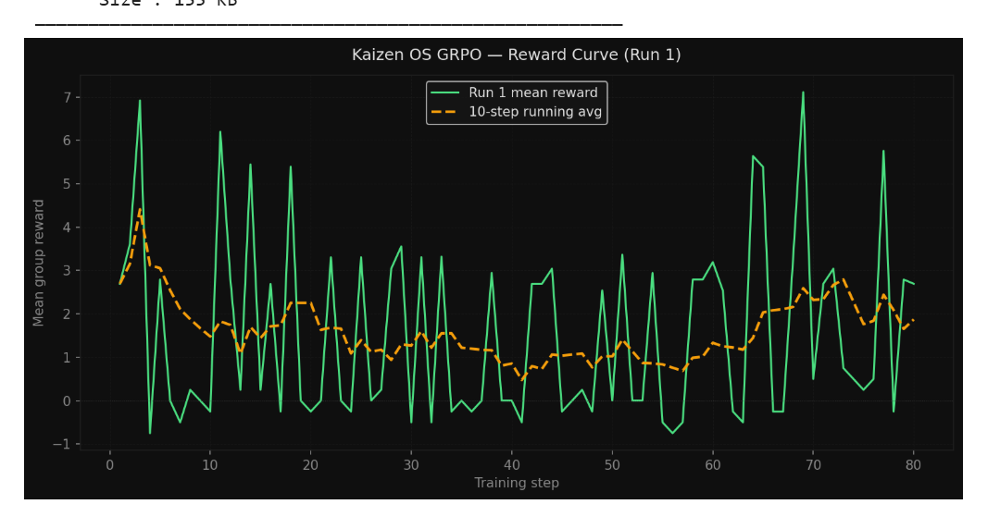
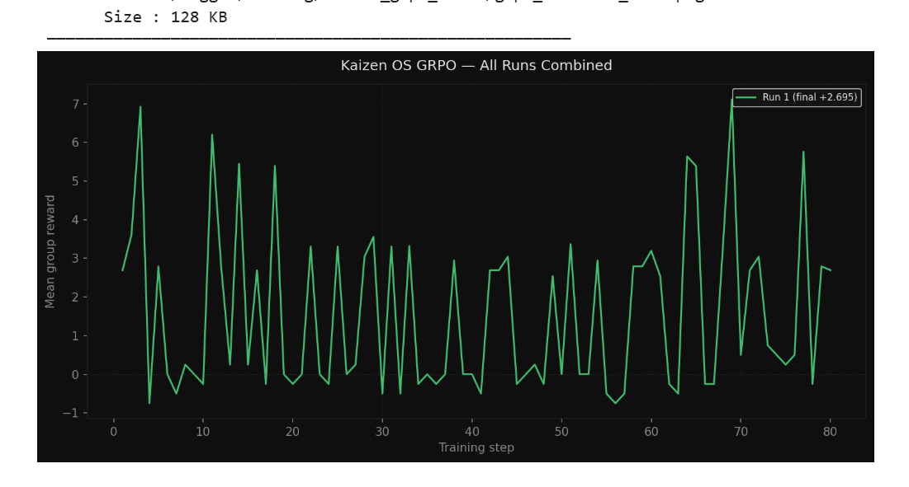

# 🧠 Project Kaizen: The Agentic Kernel

> An LLM agent that autonomously manages a simulated operating system — detecting chaos events, reasoning through them, and taking corrective actions in real time.

**Meta × Scaler OpenEnv Hackathon Submission**  
**Theme 3.1** — World Modeling (Professional Tasks)  
**Theme 2** — Long-Horizon Planning  
**Author** — Neha Chikle

---

## 🔗 Links

| Resource | URL |
|---|---|
| 🤗 HuggingFace Space (Live Demo) | [NehaChikle/kaizen-os](https://huggingface.co/spaces/NehaChikle/kaizen-os) |
| 🤗 GRPO Trained Model | [NehaChikle/kaizen-grpo](https://huggingface.co/NehaChikle/kaizen-grpo) |
| 🤗 SFT Model | [NehaChikle/kaizen-sft](https://huggingface.co/NehaChikle/kaizen-sft) |
| 💻 GitHub Repo | [ChikleNeha/kaizen2](https://github.com/ChikleNeha/kaizen2) |
| 📓 Training Notebook | [Kaggle Notebook](https://www.kaggle.com/code/nehachikle/kaizen-training-script) |
| 📝 Blog / Writeup | [Blog.md](./Blog.md) |

---

## 🏗️ What is this?

Kaizen OS is a reinforcement learning environment where a fine-tuned Qwen2.5-3B LLM acts as an autonomous OS kernel manager. It:

- Reads **real system telemetry** (CPU, RAM, thermals) via `psutil`
- Detects injected **chaos events** (memory leaks, CPU hogs, thermal spikes)
- Reasons through the situation using **chain-of-thought**
- Calls **structured tool actions** (kill process, throttle CPU, etc.)
- Gets trained via **SFT → GRPO** to improve over episodes

---

## 📁 Project Structure

```
kaizen2/
├── environment/
│   ├── kaizen_env.py          # Gymnasium-style OpenEnv environment
│   ├── action_space.py        # Pydantic action models + JSON parser
│   ├── observation_space.py   # Real psutil telemetry builder
│   ├── reward.py              # Reward function
│   ├── chaos.py               # Chaos event injector
│   └── sandbox.py             # Simulated sandbox executor
├── agent/
│   ├── llm_agent.py           # LLM inference + JSON parser
│   ├── demo_agent.py          # Rule-based agent for Space demo
│   └── prompts.py             # System prompt + observation formatter
├── training/
│   ├── golden_examples.json   # 60 hand-crafted SFT examples
│   ├── sft_train.py           # Unsloth LoRA SFT script
│   ├── grpo_train.py          # TRL GRPOTrainer script
│   └── plots/                 # Training evidence (PNG files)
├── server/
│   ├── main.py                # FastAPI + WebSocket server
│   └── broadcast.py           # WebSocket connection manager
├── frontend/
│   └── src/
│       ├── App.jsx
│       ├── components/        # TopBar, VitalsPanel, ProcessGraph, etc.
│       └── hooks/
│           └── useWebSocket.js
├── docker/
│   └── Dockerfile.sandbox
├── Dockerfile                 # HF Space Docker image
├── requirements.txt
├── openenv.yaml
└── README.md
```

---

## 📊 Training Evidence

### GRPO Reward Curve (Run 3)


### All Runs Combined


Training pipeline: **Base Qwen2.5-3B → SFT (60 golden examples) → GRPO (3 runs × 80–150 steps)**

The reward curve shows the agent learning to correctly identify and terminate chaos processes, with the running average climbing from ~+1.0 to ~+2.5+ across runs.

---

## ⚙️ How to Run Locally

### Prerequisites
- Python 3.11+
- Node.js 18+
- GPU recommended (T4 or better for LLM inference)

### 1 — Clone the repo
```bash
git clone https://github.com/ChikleNeha/kaizen2.git
cd kaizen2
```

### 2 — Install Python dependencies
```bash
pip install -r requirements.txt
```

### 3 — Install and build frontend
```bash
cd frontend
npm install
npm run build
cd ..
```

### 4 — Run the backend server
```bash
# Demo mode (no model needed — instant startup)
KAIZEN_DEMO_MODE=true uvicorn server.main:app --host 0.0.0.0 --port 8000

# Real model mode (needs GPU + model downloaded)
KAIZEN_DEMO_MODE=false \
KAIZEN_MODEL_PATH=./kaizen_grpo_model \
uvicorn server.main:app --host 0.0.0.0 --port 8000
```

### 5 — Open the dashboard
```
http://localhost:8000
```

Click **Start Episode** to watch the agent in action.

---

## 🚀 Running with Real GRPO Model (Live Demo Setup)

For live inference with the trained GRPO model, run the backend on a GPU machine and expose it via ngrok:

```bash
# 1. Download trained model from HF Hub
python -c "
from huggingface_hub import snapshot_download
snapshot_download(
    repo_id='NehaChikle/kaizen-grpo',
    repo_type='model',
    local_dir='./kaizen_grpo_model',
)
"

# 2. Start backend with real model
KAIZEN_DEMO_MODE=false \
KAIZEN_MODEL_PATH=./kaizen_grpo_model \
KAIZEN_USE_UNSLOTH=true \
uvicorn server.main:app --host 0.0.0.0 --port 8000

# 3. In a separate terminal, expose via ngrok
ngrok http 8000
```

Then visit your HF Space with the ngrok URL appended:
```
https://NehaChikle-kaizen-os.hf.space?backend=https://YOUR-NGROK-URL
```

---

## 🧪 Training from Scratch

### SFT (Supervised Fine-Tuning)
```bash
# On Colab/Kaggle T4 GPU
python training/sft_train.py
# Output: ./kaizen_sft_model
```

### GRPO (Reinforcement Learning)
```bash
# Run after SFT
python training/grpo_train.py
# Output: ./kaizen_grpo_model
# Re-run to continue improving the same policy
```

Or use the **Kaggle training notebook**: [[Link](https://www.kaggle.com/code/nehachikle/kaizen-training-script)]

---

## 📓 Kaggle Notebook Setup

The training notebook handles everything end to end. Before running:

### Secrets to add in Kaggle
Go to **Add-ons → Secrets** inside the notebook and add:

| Secret Name | Value | Used for |
|---|---|---|
| `GITHUB_TOKEN` | Your GitHub PAT (classic, repo scope) | Cloning and pushing repo |
| `HF_TOKEN` | Your HuggingFace token (write access) | Pushing models to HF Hub |
| `NGROK_TOKEN` | Your ngrok authtoken | Live demo tunnel (optional) |

### Enable secrets per notebook
After adding secrets globally, toggle them **ON** inside the notebook:
- Add-ons → Secrets → toggle ON `GITHUB_TOKEN` and `HF_TOKEN`

### Kaggle session settings
- **Accelerator**: GPU T4 x2
- **Persistence**: Files
- **Internet**: ON (required for secrets and HF Hub)

---

## 🤗 HuggingFace Space Setup

The Space runs the React dashboard with a rule-based DemoAgent by default (no GPU needed).

### Variables to set in Space Settings
Go to your Space → **Settings → Variables and secrets**:

| Name | Type | Value |
|---|---|---|
| `KAIZEN_DEMO_MODE` | Variable | `true` |
| `HF_TOKEN` | Secret | Your HF token |
| `HF_ENDPOINT_URL` | Variable | Your inference endpoint URL (if using) |

### To rebuild the Space after code changes
```bash
# In your Space repo (separate from code repo)
git add .
git commit -m "update"
git push
# Space rebuilds automatically
```

---

## 🎬 Demo Script (for judges)

1. Open the HF Space: [kaizen-os](https://huggingface.co/spaces/NehaChikle/kaizen-os)
2. All vitals show green — system is idle
3. Click **Start Episode**
4. At step 3 — chaos injects. Watch the graph node turn red and pulse
5. Agent reasons through chain-of-thought panel (typewriter animation)
6. Agent calls `kill_process` — node dissolves with fade animation
7. Vitals recover — bars animate back to green
8. Reward tracker shows cumulative improvement

---

## 🛠️ Tech Stack

| Layer | Technology |
|---|---|
| LLM | Qwen2.5-3B-Instruct |
| Fine-tuning | Unsloth + LoRA (SFT), TRL GRPOTrainer (RL) |
| Environment | Gymnasium-style OpenEnv, psutil |
| Backend | FastAPI + WebSockets |
| Frontend | React 18 + TailwindCSS + HTML5 Canvas |
| Training | Kaggle T4 x2 GPU (free) |
| Model storage | HuggingFace Hub |
| Deployment | HuggingFace Spaces (Docker) |

---

## 📋 OpenEnv Compliance

This project implements a valid OpenEnv environment. See `openenv.yaml` for the full spec.

```yaml
# openenv.yaml
env_id: KaizenOS-v1
base_class: gymnasium.Env
reset: "returns obs dict + info dict"
step: "accepts action string, returns obs, reward, terminated, truncated, info"
observation_space: "Dict with cpu_percent, ram_percent, thermal_celsius, process_list, etc."
action_space: "Discrete tool calls validated via Pydantic"
```

---

## 📜 License

MIT