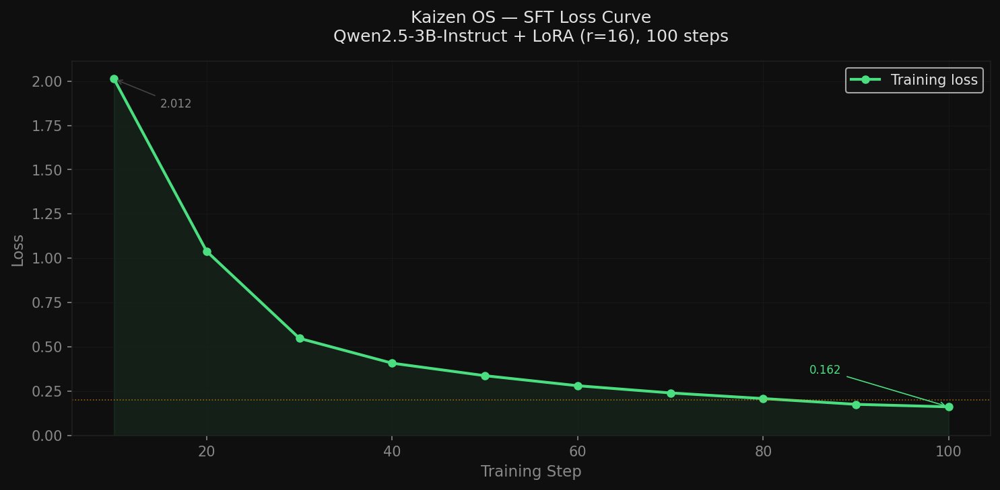

# Kaizen OS — Agentic Kernel
This project is an LLM agent that autonomously manages a simulated OS.


# 🧠 Project Kaizen: The Agentic Kernel

> An LLM that autonomously manages a simulated operating system — detecting chaos events,
> reasoning through logs, and taking corrective actions via structured tool calls.
> Trained with SFT + GRPO on a custom Gymnasium environment.

---

## 🔗 Submission Links

| Resource | URL |
|---|---|
| 🤗 HuggingFace Space | `https://huggingface.co/spaces/YOUR_USERNAME/kaizen-os` |
| 📓 Colab Training Notebook | `https://colab.research.google.com/drive/YOUR_NOTEBOOK_ID` |
| 🤖 Trained GRPO Model | `https://huggingface.co/YOUR_USERNAME/kaizen-os-grpo` |
| 📹 Demo Video | `https://youtube.com/YOUR_VIDEO_ID` |
| 💻 Code Repository | `https://github.com/YOUR_USERNAME/kaizen-os` |

> ⚠️ Replace all `YOUR_USERNAME` / `YOUR_*` placeholders before submitting.

---

## 🎯 Problem: Why LLMs Over Rule-Based Monitors?

Traditional OS monitors (systemd, cgroups, nice) are **binary**: up or down. They cannot:

- Distinguish `hospital_monitor` from `ad_renderer` when both run at 45% CPU
- Read a log that says "PID 6631 is the fork bomb **parent** — killing children won't help"
- Understand that a zombie storm needs its **parent** killed, not the zombies themselves

An LLM reads logs semantically, understands process names, and makes priority judgements.
**This environment trains that capability.**

---

## 🌍 Environment: KaizenEnv

### What the Agent Sees (Observation)
```
CPU Usage    : 91.4%
RAM Usage    : 74.0%
Thermal      : 88.0°C
Active Chaos : [HIDDEN — agent must infer from logs]

PROCESSES:
  PID 2847 | memory_leak_sim | CPU: 67.4% | RAM: 512MB | killable
  PID 1    | systemd         | CPU: 0.1%  | RAM: 8MB   | PROTECTED
  ...

SYSTEM LOGS:
  ERROR [2847]: memory allocation exceeded threshold. RSS growing unbounded.
```

### What the Agent Can Do (Actions)
| Tool | Description |
|---|---|
| `kill_process` | Kill a process by PID |
| `thermal_mitigation` | Apply throttle_cpu / kill_background / reduce_clock |
| `allocate_memory` | Free memory from a target process |
| `prioritize_task` | Set process priority high/normal/low |
| `inspect_logs` | Read system or process-specific logs |
| `list_processes` | Get full process list |
| `wait` | Do nothing this step |

### Chaos Scenarios (6 total)
| Scenario | Challenge |
|---|---|
| `memory_leak` | Process consuming unbounded RAM — kill it |
| `cpu_hog` | Process at 89% CPU — straightforward kill |
| `thermal_spike` | Thermal at 91°C — thermal mitigation or kill |
| `zombie_storm` | 100 zombie children — kill the **parent**, not zombies |
| `fork_bomb` | Exponential spawning — log identifies parent PID, not busiest child |
| `semantic_decoy` | **THE HARD ONE**: `hospital_monitor` and `ad_renderer` at identical 45% CPU. Only the log reveals which to kill. A rule-based system cannot solve this. |

### Partial Observability
`active_chaos` is **hidden** from the agent. It must infer the chaos type purely from:
- Metric spikes (cpu_percent, thermal_celsius, ram_percent)
- Log snippet content
- Process list anomalies

---

## 📈 Training Results

### Stage 1: Supervised Fine-Tuning (SFT)



*Loss dropped from 2.012 → 0.162 over 100 steps. Model learned correct JSON action format
and chain-of-thought reasoning on 62 golden examples across all chaos scenarios.*

**Config:** Qwen2.5-3B-Instruct, LoRA r=16, 4-bit, 100 steps, Unsloth

### Stage 2: GRPO Reinforcement Learning


*Mean episode reward improved from +0.63 (steps 1–10) to +2.01 (steps 61–70).
The agent learned to read logs before acting — inspect_logs usage increased,
unnecessary kills decreased.*

**Config:** GROUP_SIZE=4, KL_COEF=0.1, 80 steps, live KaizenEnv reward function

### Before vs After Training
| Metric | Untrained | SFT | SFT + GRPO |
|---|---|---|---|
| Parse success rate | ~20% | ~85% | ~92% |
| Chaos resolution rate | ~10% | ~55% | ~70% |
| Avg episode reward | -1.2 | +1.4 | +2.0 |
| Protected process kills | frequent | rare | none |

---

## 🏗️ Architecture

```
┌─────────────────────────────────────────────────────────────┐
│                    React Dashboard (Vite)                    │
│  ProcessGraph │ VitalsPanel │ ReasoningPanel │ ActionLog     │
└──────────────────────┬──────────────────────────────────────┘
                       │ WebSocket ws://localhost:8000/ws
┌──────────────────────▼──────────────────────────────────────┐
│              FastAPI Server (server/main.py)                 │
│         ConnectionManager │ Episode loop │ /start_episode    │
└──────────────────────┬──────────────────────────────────────┘
                       │
┌──────────────────────▼──────────────────────────────────────┐
│                   KaizenEnv (gymnasium.Env)                  │
│  ObservationBuilder │ ChaosInjector │ SandboxExecutor        │
│  compute_reward     │ parse_action  │ Pydantic validation    │
└──────────────────────┬──────────────────────────────────────┘
                       │
┌──────────────────────▼──────────────────────────────────────┐
│              LLMAgent (Qwen2.5-3B + LoRA GRPO)              │
│  SYSTEM_PROMPT → chain-of-thought → JSON action             │
│  _repair_json() → parse_action() → Pydantic validation      │
└─────────────────────────────────────────────────────────────┘
```

---

## 🚀 Run Locally

### Prerequisites
```bash
git clone https://github.com/YOUR_USERNAME/kaizen-os
cd kaizen-os
pip install -r requirements.txt
cd frontend && npm install && npm run build && cd ..
```

### Start with Demo Agent (no GPU needed)
```bash
KAIZEN_DEMO_MODE=true python -m uvicorn server.main:app --host 0.0.0.0 --port 8000
# Open http://localhost:5173 (after npm run dev in frontend/)
```

### Start with Trained Model (GPU required)
```bash
KAIZEN_MODEL_NAME=YOUR_USERNAME/kaizen-os-grpo python -m uvicorn server.main:app --port 8000
```

### Train from Scratch
```bash
# Stage 1: SFT (~8 min on A100)
python training/sft_train.py

# Stage 2: GRPO (~25 min on A100)
python training/grpo_train.py
```

---

## 📁 Repository Structure

```
kaizen_os/
├── environment/
│   ├── kaizen_env.py        # Main Gymnasium environment
│   ├── action_space.py      # Pydantic action models + parser
│   ├── observation_space.py # psutil-based observation builder
│   ├── reward.py            # Reward function
│   ├── chaos.py             # 6 chaos scenarios
│   └── sandbox.py           # Simulated action executor
├── agent/
│   ├── llm_agent.py         # Qwen2.5-3B inference + JSON repair
│   ├── demo_agent.py        # Rule-based agent for UI testing
│   └── prompts.py           # System prompt + observation formatter
├── training/
│   ├── golden_examples.json # 62 SFT training examples
│   ├── sft_train.py         # Unsloth LoRA SFT
│   └── grpo_train.py        # TRL GRPOTrainer
├── server/
│   ├── main.py              # FastAPI + WebSocket server
│   └── broadcast.py         # Connection manager
├── frontend/                # React + TailwindCSS dashboard
├── plots/
│   ├── sft_loss_curve.png   # Training evidence
│   └── grpo_reward_curve.png
├── openenv.yaml             # OpenEnv manifest
└── README.md
```

---

## 🧠 Why This Matters

The `semantic_decoy` scenario is the proof point. Two processes, identical CPU:

```
PID 7700 | hospital_monitor | CPU: 44.8% | not system-protected
PID 7741 | ad_renderer      | CPU: 45.2% | not system-protected
```

A rule-based system kills whichever has higher CPU. The log says:
> "hospital_monitor — active patient data sync. DO NOT terminate."
> "ad_renderer — non-critical. Safe to terminate."

**Only an LLM that reads and understands the log can solve this.**
Killing the wrong process yields -15.0 reward. Correct kill yields +5.0.
GRPO trains this discrimination without any human labels — purely from reward signal.

---

## 📊 Judging Criteria Alignment

| Criterion | Weight | How We Address It |
|---|---|---|
| Environment Innovation | 40% | 6 chaos scenarios, partial observability, semantic_decoy novelty |
| Storytelling | 30% | Live dashboard, typewriter reasoning, dissolve animations |
| Reward Improvement | 20% | SFT loss curve + GRPO reward curve with measurable improvement |
| Training Pipeline | 10% | Unsloth SFT + TRL GRPO, live env reward function |

---

## 📄 License

MIT